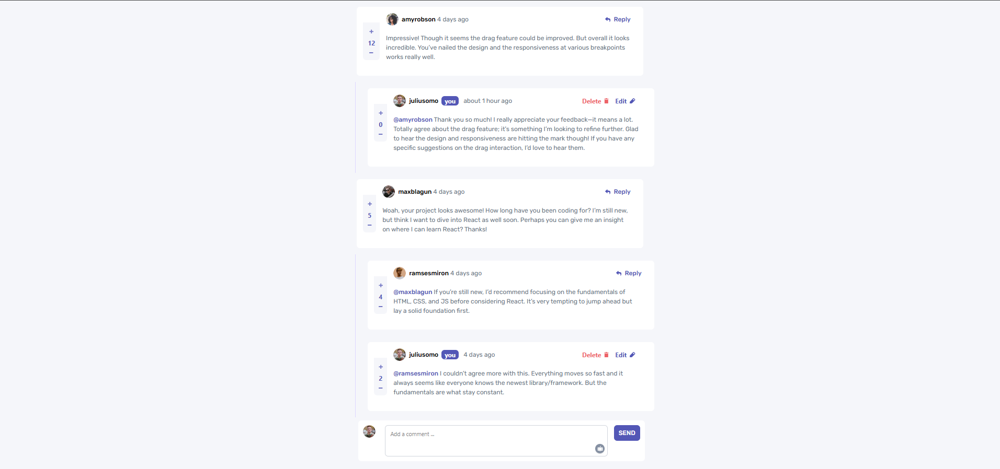

# Interactive Comments Section - MERN Fullstack App

A fullstack MERN application inspired by the [Frontend Mentor - Interactive Comments Section](https://www.frontendmentor.io/challenges/interactive-comments-section-iG1RugEG9) challenge.  
It allows users to post, reply, edit, delete, and vote on comments with a clean and responsive user interface.

---

## 🔧 Tech Stack

- **Frontend:** React + Vite + Tailwind CSS
- **Backend:** Node.js + Express
- **Database:** MongoDB + Mongoose
- **Other tools:** Axios, Date-fns

---

## 🚀 Features

- Add **top-level comments** and **replies**
- Edit comments and replies (inline editing)
- Delete comments and replies with confirmation modal
- Voting system (upvote/downvote) with one vote per user per comment
- Responsive design
- One-level reply depth (no deeply nested replies)

---

## 🖼️ Preview



---

## 📁 Project Structure

```
client/         # Frontend (React)
server/         # Backend (Express)
```

---

## ⚙️ Installation

### 1. Clone the repo

```bash
git clone https://github.com/aouintihouari/interactive-comments-section.git
cd interactive-comments-section
```

### 2. Install dependencies

#### Backend

```bash
cd server
npm install
```

#### Frontend

```bash
cd ../client
npm install
```

---

## 🔑 Environment Variables

Create a `.env` file inside the `server` directory with the following content:

```
PORT=5000
MONGO_URI=your_mongodb_connection_string
```

---

## ▶️ Running the App

### Start the backend

```bash
cd server
npm run dev
```

### Start the frontend

```bash
cd client
npm run dev
```

The frontend should be accessible at [http://localhost:5173](http://localhost:5173)

---

## 📦 REST API Endpoints

### GET /api/v1/comments

> Retrieve all comments

### POST /api/v1/comments

> Create a new comment or reply

### PATCH /api/v1/comments/:id

> Edit a comment or reply

### DELETE /api/v1/comments/:id

> Delete a comment or reply

### PATCH /api/v1/comments/:id/vote

> Upvote or downvote a comment

---

## 🧑‍💻 Author

Houari Aouinti

---

## 📄 License

MIT
